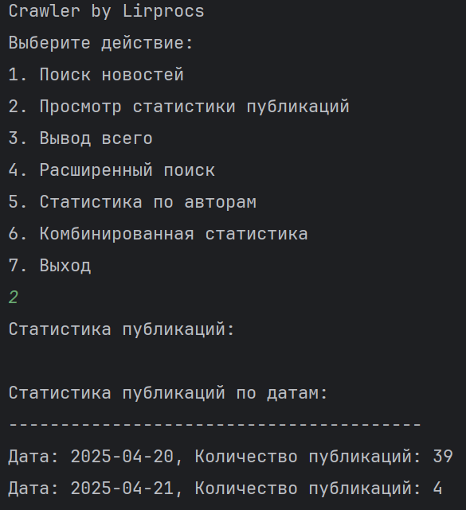
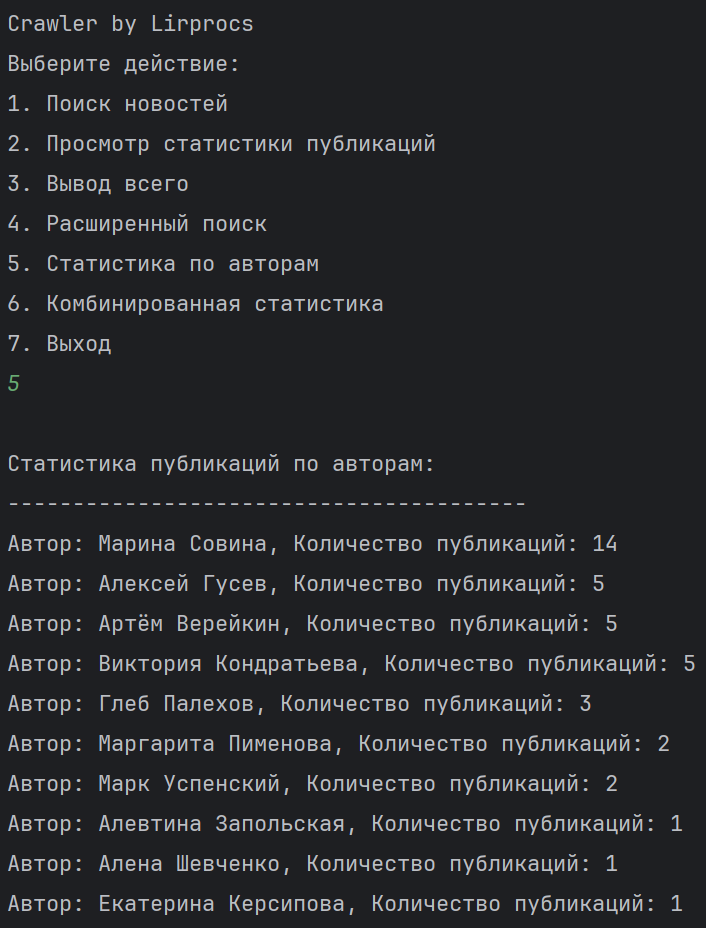
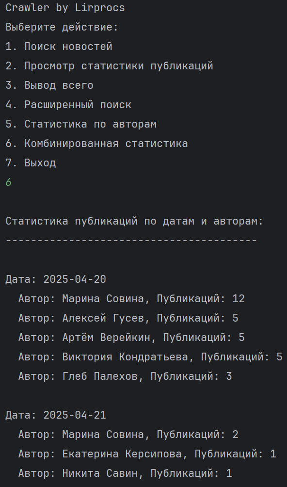
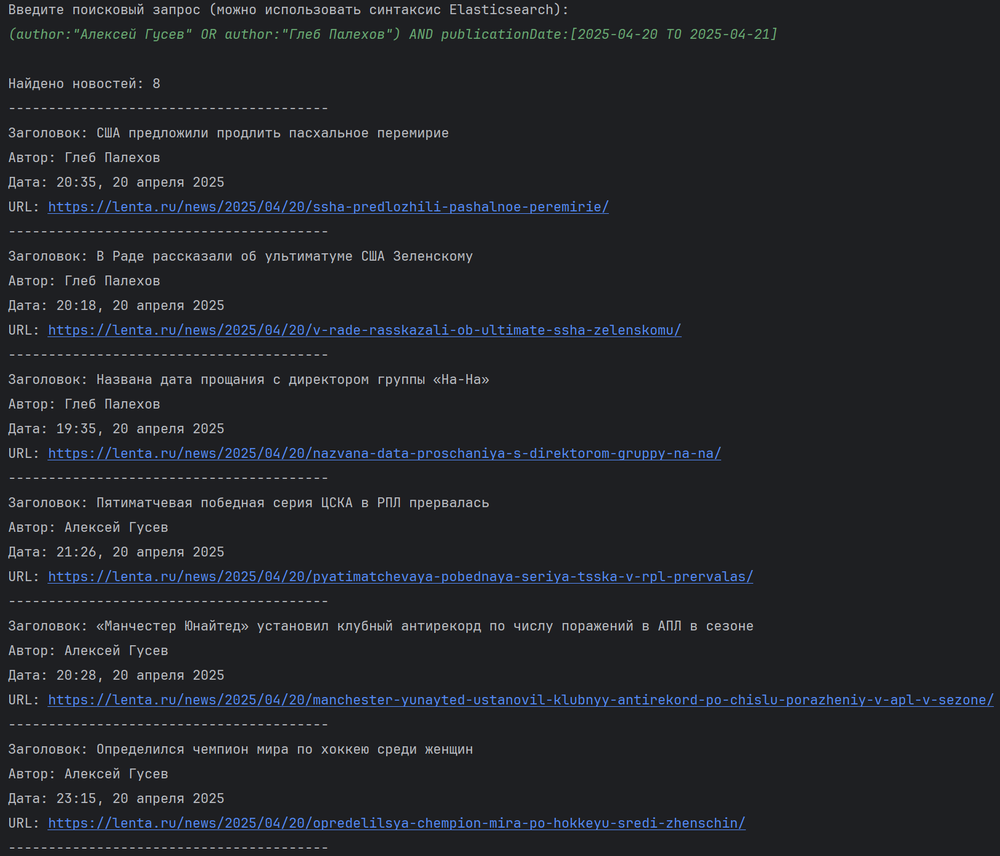
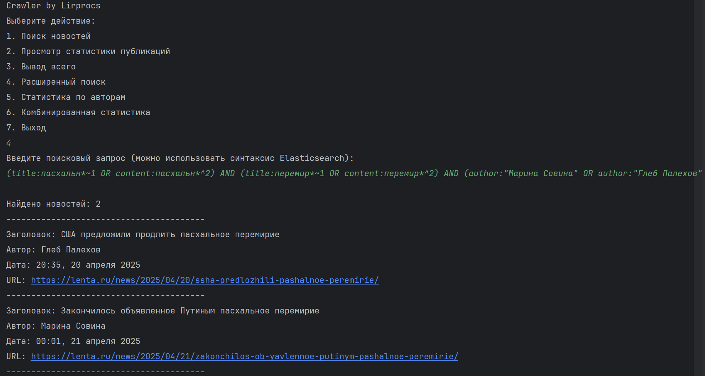

# 3 Часть. 
## Сохранение данных в базу

1.	использовать базу Elastic search
2.	создать индекс для хранения документов с соответствующими полями (заголовок, время публикации, текст, ссылка, автор)
3.	в планировщике (при парсинге стартовой страницы) сохранять с идентификаторами, вычисленными как хэш от заголовка и даты документа (или хэш от ссылки на страницу с новостью)
4.	проверять наличие в базе документа по идентификатору (хеш) - не пускать в обработку если уже существует
5.	считывать документы из очереди с результатами и обновлять их в базе по идентификатору (хэш от заголовка и даты документа)
6.	выполнять поиск по нескольким полям документа в разных комбинациях (с различными логическими операторами)
7.	уметь составлять сложные полнотекстовые поисковые запросы (понимать синтаксис полнотекстового поиска ElasticSearch)
8.	выполнять различные типы агрегаций (например вывод гистограммы по количеству публикаций на различные даты и для различных авторов)

## Примеры работы:
### Просмотр статистики

### Статистика по авторам

### Статистика публикаций по датам и авторам

### Поиск по нескольким полям

### Сложный полнотекстовый поисковый запрос

docker-compose up -d
